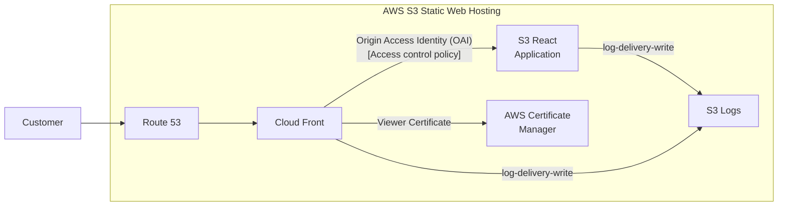

## Description

Expecting an ACM certificate existing in the us-east-1 region, this catalog sprinkles the ingrediants of a static web hosting website using CloudFront OAI as a bucket policy for an s3 bucket. At the bucket level, this infrastructure provisions both a website and website logging. CORS is configured with GET and HEAD, and the canned ACL is preset to Private.

This project also creates an A Record in Route 53 pointing to the generated CloudFront distribution. The Custom Error Responses in the CloudFront Distribution are common practices for hosting a React application for Static Web Hosting.

This infrastructure is designed to be utilized in other projects. Please checkout the examples/basic-usage implementation to see how you could utilize this infrastructure on Team-specific projects.

## Input Variables

| Name | Description | Type | Default | Required |
|------|-------------|------|---------|:--------:|
| name_prefix | name prefix | String | None | Yes|
| name_suffix | name suffix | String | None | Yes|
| environment | environment | String | None | Yes|
| ui_name | ui name | String | None | Yes|
| hosted_zone_name | hosted zone name| String | None | Yes|
| certificate_arn | certificate arn| String | None | Yes|
| domain_name | domain name | String | None | Yes|

## Output Variables

| Name | Description | Type |
|------|-------------|------|
| sftp_client_bucket | sftp client bucket | String |
| route53_domain | route53 domain | String |

## Diagram

